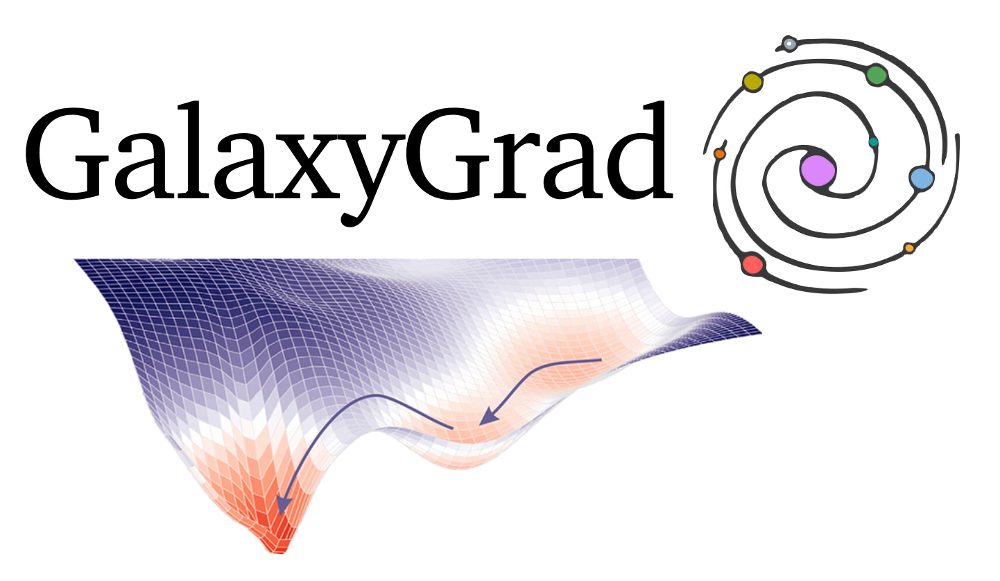

[](https://arxiv.org/abs/2401.07313)
[](https://github.com/psf/black)
[](https://pypi.org/project/galaxygrad/)




# GalaxyGrad
Package for a score-based diffusion model trained on HSC galaxies, ZTF like simulations, lensed quasars and more.
See https://pypi.org/project/galaxygrad/0.3.0/.
The prior models are stored in a huggingface repository at https://huggingface.co/sampsonML/galaxy-score-based-diffusion-models. Get in contact to add, or request new priors.

> [!WARNING]  
> Galaxygrad has recently changed how models are stored and loaded in, please see updated guidlines.

Usage:
Install the package from pip

```shell
pip install galaxygrad
```
We can now see what priors we have available
```python
from galaxygrad import show_available_models, get_prior
# see the available priors
print(show_available_models())
```

To use a model, we can use the get_prior method to download a prior, which can be stored to a specific location using the local_dir flag if desired.
```python
# define a path, or leave this as None to store in .cache/huggingface dir
path = /path/to/model/
prior = get_prior('hsc32', local_dir=path)
```

We can see information about this prior in the following ways 
```python
print(prior.info())
print(f"model located at {prior.path}")
print(f"shape of this prior is {prior.shape()}")
```

You can now use the pre-loaded priors on and 2D arrays the same size as the numerical value of the prior name, ie HSC_ScoreNet64 takes 64 by 64 arrays.

```python
galaxy = np.ones([64,64])
galaxy = np.expand_dims(galaxy, axis=0) # the prior requires 3 dimensions for easier use in vmapped functions (batch processing)
gradients = prior(galaxy)
```

## Use with Scarlet2
Likely you are here from your use of the scarlet2 deblending tool (https://scarlet2.readthedocs.io/en/latest/). The use of galaxygrad priors in this framework can be used as following
```python
from scarlet2.nn import ScorePrior
prior = get_prior('hsc32')
temp = 1e-2
prior=ScorePrior(prior, prior.shape(), t=temp)
```
